`시작하세요 하둡 프로그래밍`을 기반으로 공부한 내용을 정리합니다.

## 도커 기반으로 쉽게 하둡 설치

도커를 사용해서 쉽게? 하둡을 설치할 수 있습니다.
[관련 영상](https://www.youtube.com/watch?v=dLTI2HN9Ejg).을 참고하시면 됩니다.

제가 forks한 링크는 [여기](https://github.com/lsh110600/docker-hadoop).입니다. 필요하신 분들은 folk 하세요.

## STEP 0

윈도우에서 wsl2 및 도커 데스크탑을 설치합니다. 
기본적으로 도커를 사용할 수 있다는 전제하에 post를 작성하겠습니다.

## STEP 1

1. shell에서 wsl로 들어간 후 `git clone https://github.com/lsh110600/docker-hadoop.git` 명령어로 folk한 깃허브 레포지토리를 download 합니다.

    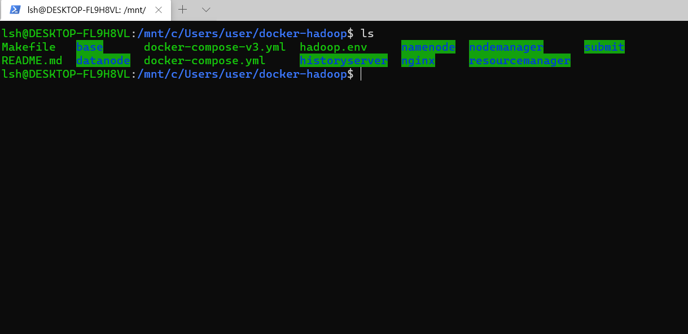

2. 이후 `docker compose up -d`를 실행합니다.

    - **docker compose**는 여러 개의 컨테이너(container)로 구성된 애플리케이션을 관리하기 위한 간단한 오케스트레이션(Orchestration) 도구입니다.

    - **docker compose up**은 Docker Compose에 정의되어 있는 모든 서비스 컨테이너를 한 번에 생성하고 실행하기 위해서 사용합니다.

    - 이때 **-d** 옵션이 붙으면, 백그라운드에서 컨테이너를 띄울 수 있습니다.

    실행하면, 다음과 같이 download를 진행합니다.
    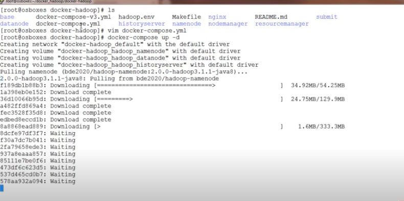

3. 다운로드가 끝나면, `docker container ls`로 실행 중인 도커 컨테이너 리스트를 보겠습니다.

    - `docker ps`를 써도 됩니다.
    - namenode, datanode, nodemanager, resourcemanager 등이 실행된 것을 볼 수 있습니다.

    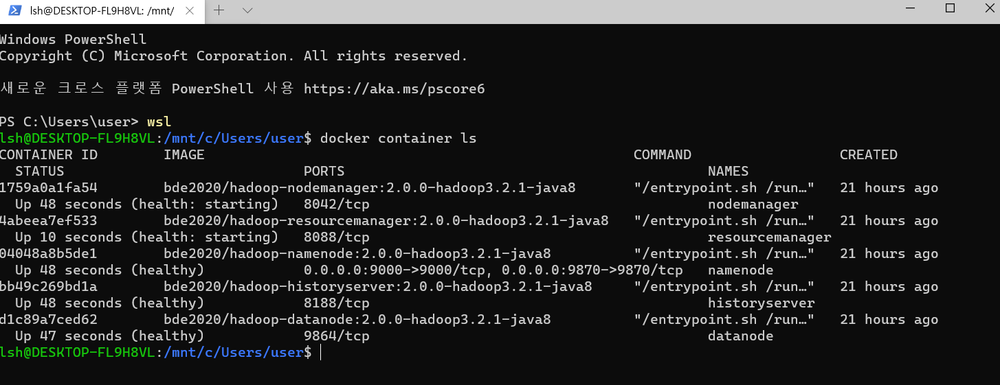

4. 모두 정상적으로(healthy) 동작한다면, namenode docker container에 들어가기 위해 `docker exec -it namenode /bin/bash` 명령어를 넣습니다.

    - `docker exec`는 container에 특정 명령을 실행할 수 있는 것인데 이때 명령을 /bin/bash 로 주면, 해당 컨테이너의 shell에 접속할 수 있다.

    - `-it` 옵션은 표준 입출력 및 bash를 사용하기 위해 TTY 모드(pseudo-TTY)를 활성화하는데 쓰임.

5. namenode로 들어가서 hdfs 명령어가 작동하는지 확인합니다.

    - `hdfs dfs -ls /`를 치면, /rmstate 만 있어야 정상입니다. 저는 user/root 디렉토리를 만들었습니다.

    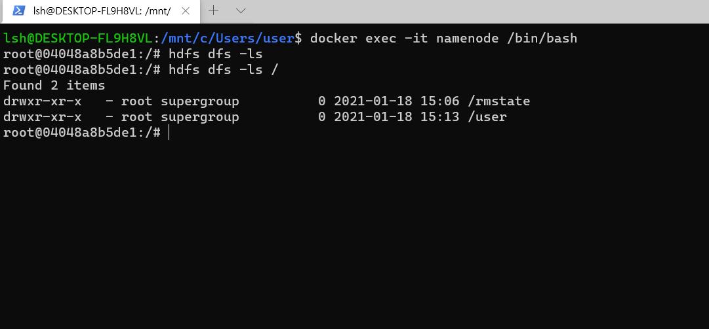

    - 디렉토리를 만드는 명령어는 `hdfs dfs -mkdir -p /user/root` 입니다.

6. 하둡 웹 UI 접속

    - 하둡은 HDFS를 브라우저로 관리할 수 있는 웹 UI를 제공합니다.

    - `http://네임노드IP:네임노드포트`로 접속할 수 있습니다.

    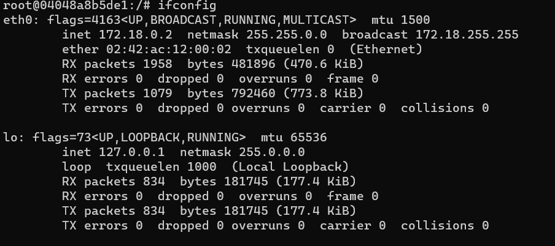

    - 아이피를 얻어내기 위해서는 `ifconfig` 명령어를 쳐서 아이피를 볼 수 있습니다.
    - 저의 경우 127.0.0.1 입니다.
    - 이후 namenode의 포트번호를 알아야하는데, `docker ps` 명령어로 볼 수 있습니다.
    - 하지만 namenode 컨테이너에서는 명령어가 먹지 않습니다. (아래 사진 참고)
    - 따라서 exit 명령어로 컨테이너를 나가서 `docker ps`로 포트번호를 볼 수 있습니다.
    
    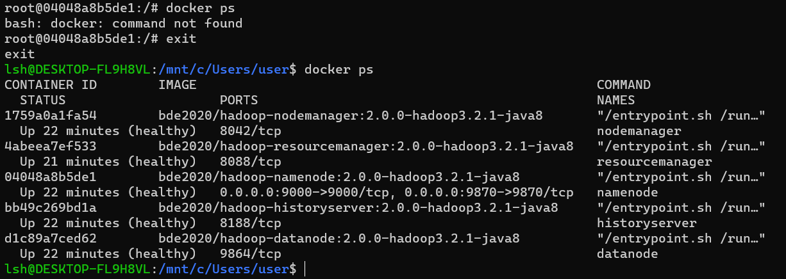
    
    - 저의 경우는 9870 포트입니다.
    - `http://127.0.0.1:9870/`로 접속하면, 웹 UI로 하둡을 관리할 수 있습니다.

    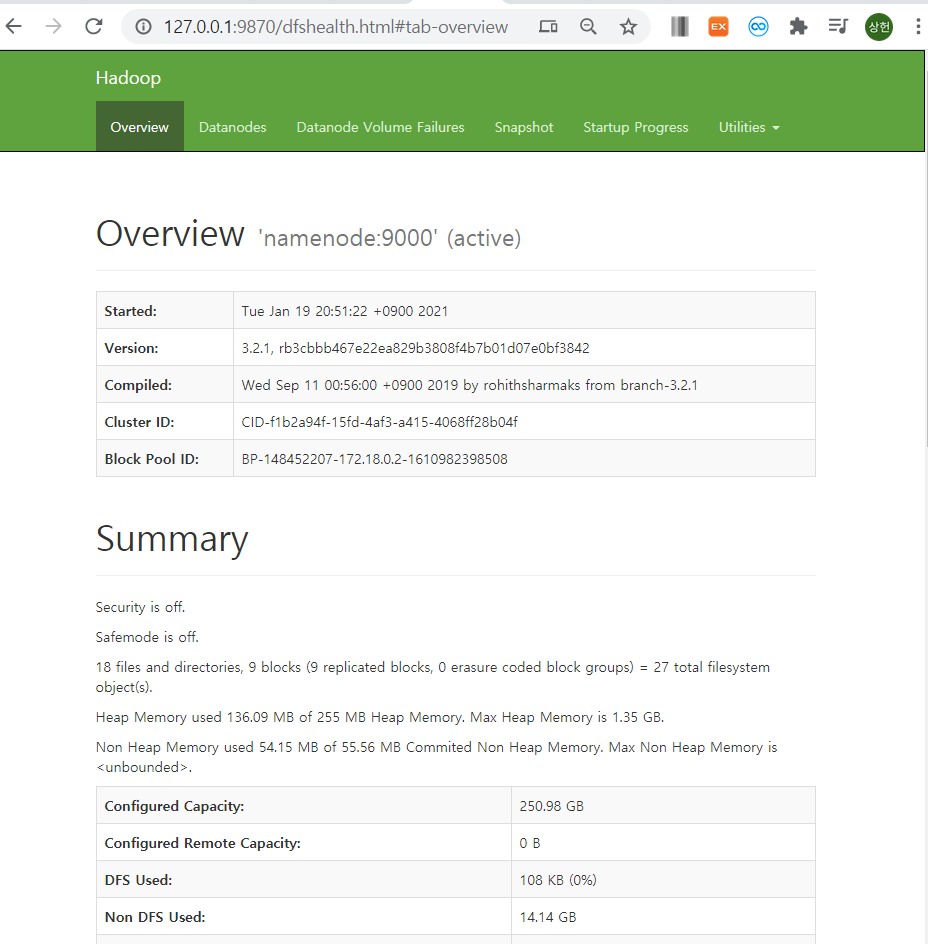

7. 맵리듀스 example jar 파일 다운

    - 현재 하둡 버전이 3.2.1이기 때문에 해당 버전에 맞는 맵리듀스 jar 파일을 받습니다.
    - `exit`으로 나온 후 `wget https://repo.maven.apache.org/maven2/org/apache/hadoop/hadoop-mapreduce-examples/3.2.1/hadoop-mapreduce-examples-3.2.1-sources.jar` 명령어를 치면 다운로드가 됩니다.

    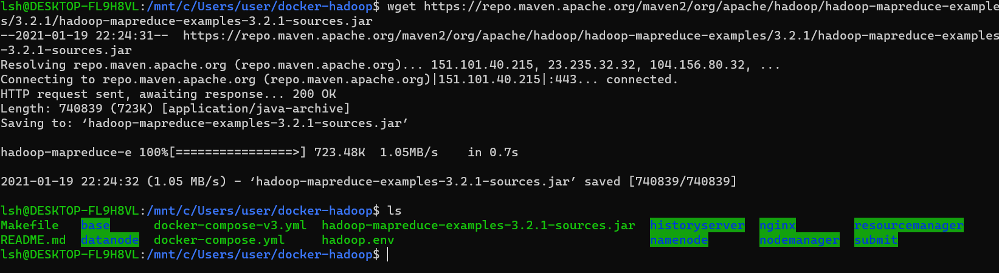

    - 다운로드 받은 파일을 컨테이너에 넣어야합니다.
    - `docker cp hadoop-mapreduce-examples-3.2.1-sources.jar namenode:/tmp/`

    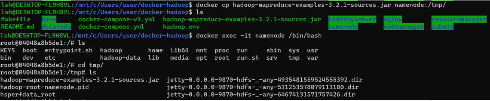

    - 명령어를 실행하고 namenode의 tmp에 가면, jar 파일이 옮겨진 것을 볼 수 있습니다.

8. input txt 파일 만들기

    - 맵리듀스 실행용 txt 파일을 만듭니다.
    - wsl bash에서 `vim input_test.txt`로 아무 문장을 입력 해줍니다.
    - 이후 같은 방법으로 namenode에 옮겨줍니다. `docker cp input_test.txt namenode:/tmp/`
    - 맵리듀스를 실행하려면 hdfs에 input_test.txt 파일이 있어야합니다. 따라서 hdfs에 입력파일을 모아두는 디렉토리를 만들겠습니다.
    - `hdfs dfs -mkdir /user/root/input`으로 input 디렉토리를 만들 수 있습니다.
    - **put** 옵션으로 파일을 hdfs에 넣을 수 있습니다. `hdfs dfs -put input_test.txt /user/root/input` 명령어를 실행 시킵니다.
    - `hdfs dfs -cat /user/root/input/input_test.txt` 명령어로 파일이 잘 들어갔나 확인해보겠습니다.

    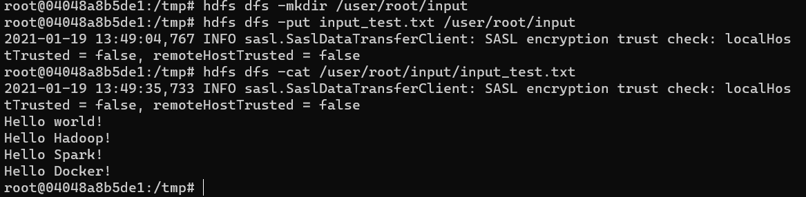

    - 입력했던 내용이 잘 들어갔습니다.

9. jar 파일 실행

    - 하둡 실행 방법은 아래와 같습니다. 
    - hadoop jar [Host jar파일] [패키지명/소스명] [입력hdfs 경로] [축력hdfs 경로]
    - 예제) hadoop jar $HADOOP_HOME/share/hadoop/mapreduce/hadoop-mapreduce-examples-3.3.0.jar wordcount input/bible.txt output/bile_gpu
    - 우리는 `hadoop jar hadoop-mapreduce-examples-3.2.1-sources.jar org.apache.hadoop.examples.WordCount input output`을 사용합니다.

    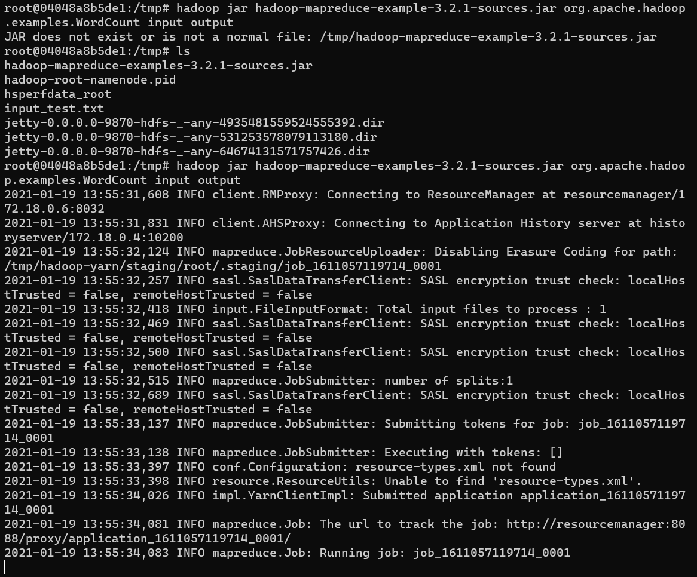

    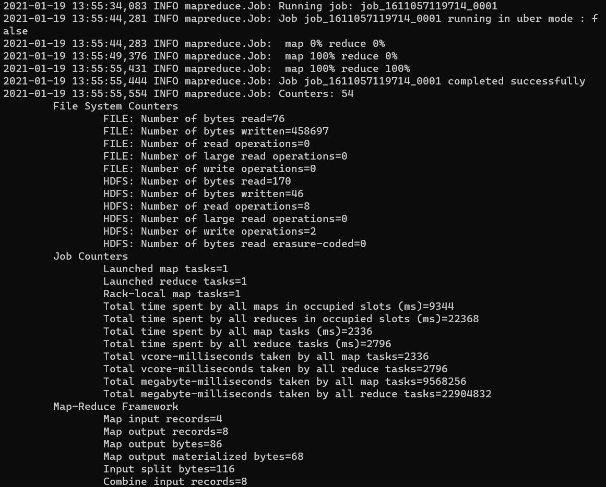

    - 실행이되면 여러 INFO들이 뜨고, map, reduce 퍼센트가 나옵니다. 사용한 예제 txt파일의 용량이 작아서 빨리 끝났지만, 데이터가 크면 상당히 오래걸립니다. 
    - 마지막은 맵리듀스 결과 요약 text가 뜨고 job이 종료됩니다.

10. 작업이 다 끝나고 docker-hadoop 내리기

    - `docker-compose down` 명령어를 사용해 작동중인 docker-hadoop을 내릴 수 있습니다.

    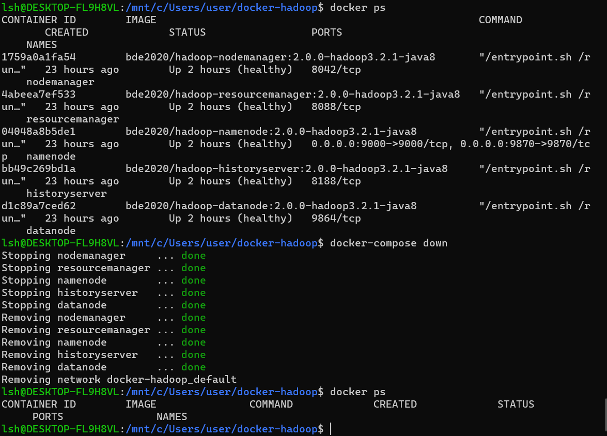

이상 하둡의 첫 포스트를 마치도록 하겠습니다.
다음 포스트는 책에 있는 내용을 요약해서 정리하도록 하겠습니다.
